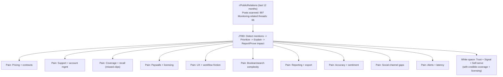

# r/PublicRelations — Media Monitoring Gap Analysis (2025-02-09 to 2026-02-09)

## Dataset
- Posts scanned (all): **997**
- Monitoring-related threads (deep analyzed): **66**

## Top Pain Themes (by thread mentions)
- UX + workflow friction: **54**
- Coverage + recall (missed clips): **46**
- Social channel gaps: **44**
- Reporting + export: **42**
- Pricing + contracts: **40**
- Support + account mgmt: **40**
- Integrations + API: **26**
- Accuracy + sentiment: **16**
- Alerts + latency: **10**
- Paywalls + licensing: **5**

## Top Vendors Mentioned (by thread mentions)
- cision: **36**
- muck_rack: **29**
- meltwater: **27**
- google_alerts: **5**
- brand24: **4**
- talkwalker: **4**
- mention_tool: **1**

## Visual Gap Map

## Vendor vs Pain Heatmap (counts by thread)
| Pain | meltwater | cision | muck_rack | brand24 |
| --- | --- | --- | --- | --- |
| Pricing + contracts | 20 | 23 | 17 | 2 |
| Support + account mgmt | 21 | 22 | 18 | 3 |
| Coverage + recall (missed clips) | 22 | 22 | 21 | 3 |
| Paywalls + licensing | 3 | 2 | 2 | 0 |
| UX + workflow friction | 24 | 25 | 22 | 4 |
| Boolean/search complexity | 2 | 1 | 1 | 0 |
| Reporting + export | 21 | 22 | 20 | 3 |
| Accuracy + sentiment | 11 | 6 | 3 | 4 |
| Social channel gaps | 22 | 23 | 19 | 3 |
| Alerts + latency | 7 | 4 | 3 | 2 |
| Integrations + API | 14 | 14 | 11 | 1 |

## Representative Threads (highest engagement)
| Date (UTC) | Title | Vendors | Pains |
| --- | --- | --- | --- |
| 2025-08-29 | [Do Journalists Even Read Press Releases](https://www.reddit.com/r/PublicRelations/comments/1n3cqm1/do_journalists_even_read_press_releases/) | cision | Coverage + recall (missed clips), Pricing + contracts, Reporting + export, Accuracy + sentiment, Social channel gaps, Support + account mgmt, UX + workflow friction |
| 2025-12-09 | [How do you count media hits?](https://www.reddit.com/r/PublicRelations/comments/1pi7ws9/how_do_you_count_media_hits/) | cision, meltwater, muck_rack | Coverage + recall (missed clips), Integrations + API, Pricing + contracts, Reporting + export, Social channel gaps, Support + account mgmt, UX + workflow friction |
| 2025-07-22 | [I'm confused about MuckRack](https://www.reddit.com/r/PublicRelations/comments/1m6n803/im_confused_about_muckrack/) | cision, meltwater, muck_rack, talkwalker | Boolean/search complexity, Coverage + recall (missed clips), Pricing + contracts, Reporting + export, Accuracy + sentiment, Social channel gaps, Support + account mgmt, UX + workflow friction |
| 2025-08-22 | [MuckRack v Meltwater?](https://www.reddit.com/r/PublicRelations/comments/1mxbog4/muckrack_v_meltwater/) | cision, meltwater, muck_rack | Coverage + recall (missed clips), Integrations + API, Pricing + contracts, Reporting + export, Social channel gaps, Support + account mgmt, UX + workflow friction |
| 2025-12-21 | [If a PR client asks you “How do we show up in AI answers?” — what do you actually say?](https://www.reddit.com/r/PublicRelations/comments/1ps8j4x/if_a_pr_client_asks_you_how_do_we_show_up_in_ai/) | cision, meltwater, muck_rack | Coverage + recall (missed clips), Pricing + contracts, Reporting + export, Social channel gaps, Support + account mgmt, UX + workflow friction |
| 2025-10-27 | [Is this OK?](https://www.reddit.com/r/PublicRelations/comments/1oho64n/is_this_ok/) | cision, muck_rack | Pricing + contracts, Reporting + export, Social channel gaps, Support + account mgmt, UX + workflow friction |
| 2025-12-17 | [PR trends in 2026... MY PR wrapped 2025 lol](https://www.reddit.com/r/PublicRelations/comments/1pp1v9w/pr_trends_in_2026_my_pr_wrapped_2025_lol/) | meltwater | Coverage + recall (missed clips), Integrations + API, Pricing + contracts, Accuracy + sentiment, Social channel gaps, Support + account mgmt, UX + workflow friction |
| 2025-07-31 | [First time doing ‘national’ PR. I have 6 weeks.](https://www.reddit.com/r/PublicRelations/comments/1mdqz2o/first_time_doing_national_pr_i_have_6_weeks/) | muck_rack | Coverage + recall (missed clips), Pricing + contracts, Reporting + export, Social channel gaps, Support + account mgmt, UX + workflow friction |
| 2026-01-13 | [How is it possible that we still have no valid alternatives to Muck Rack in 2026?](https://www.reddit.com/r/PublicRelations/comments/1qbwceu/how_is_it_possible_that_we_still_have_no_valid/) | cision, meltwater, muck_rack | Coverage + recall (missed clips), Integrations + API, Pricing + contracts, Reporting + export, Social channel gaps, Support + account mgmt, UX + workflow friction |
| 2025-08-01 | [Starting to think PR matters more for AI visibility than SEO, what do you think?](https://www.reddit.com/r/PublicRelations/comments/1mer6tz/starting_to_think_pr_matters_more_for_ai/) | muck_rack | Coverage + recall (missed clips), Integrations + API, Paywalls + licensing, Pricing + contracts, Reporting + export, Social channel gaps, Support + account mgmt, UX + workflow friction |
| 2025-11-12 | [Journalist Database  - is there truly anything comparable to Muckrack?](https://www.reddit.com/r/PublicRelations/comments/1ovg8vo/journalist_database_is_there_truly_anything/) | cision, meltwater, muck_rack | Coverage + recall (missed clips), Integrations + API, Paywalls + licensing, Pricing + contracts, Reporting + export, Social channel gaps, Support + account mgmt, UX + workflow friction |
| 2025-07-09 | [Best platform to snag reporter emails?](https://www.reddit.com/r/PublicRelations/comments/1lvv4nw/best_platform_to_snag_reporter_emails/) | cision, meltwater, muck_rack | Pricing + contracts, Reporting + export, Support + account mgmt, UX + workflow friction |
| 2025-11-10 | [How crucial is that 4-hour window in a social media crisis? A recent near-miss has me rethinking everything](https://www.reddit.com/r/PublicRelations/comments/1otcmm1/how_crucial_is_that_4hour_window_in_a_social/) | meltwater | Alerts + latency, Coverage + recall (missed clips), Integrations + API, Pricing + contracts, Reporting + export, Accuracy + sentiment, Social channel gaps, Support + account mgmt, UX + workflow friction |
| 2025-10-10 | [What does “busy” actually look like in PR?](https://www.reddit.com/r/PublicRelations/comments/1o3ftez/what_does_busy_actually_look_like_in_pr/) |  | Alerts + latency, Coverage + recall (missed clips), Integrations + API, Pricing + contracts, Reporting + export, Social channel gaps, Support + account mgmt, UX + workflow friction |
| 2025-07-19 | [Press release](https://www.reddit.com/r/PublicRelations/comments/1m3m6yu/press_release/) | cision | Coverage + recall (missed clips), Integrations + API, Pricing + contracts, Reporting + export, Social channel gaps |
| 2025-12-22 | [journalist relationships in 2026.. are they even real anymore???](https://www.reddit.com/r/PublicRelations/comments/1pt449z/journalist_relationships_in_2026_are_they_even/) | meltwater | Coverage + recall (missed clips), Pricing + contracts, Reporting + export, Accuracy + sentiment, Social channel gaps, Support + account mgmt, UX + workflow friction |
| 2025-10-20 | [7 Platforms for AI Visibility and Generative Engine Optimization (GEO)](https://www.reddit.com/r/PublicRelations/comments/1obju6j/7_platforms_for_ai_visibility_and_generative/) |  | Coverage + recall (missed clips), Integrations + API, Pricing + contracts, Reporting + export, Accuracy + sentiment, Social channel gaps, Support + account mgmt, UX + workflow friction |
| 2025-12-15 | [Any recommendations for budget-friendly PR distribution services for an early-stage Tech Startup?](https://www.reddit.com/r/PublicRelations/comments/1pn1zxt/any_recommendations_for_budgetfriendly_pr/) | cision | Coverage + recall (missed clips), Pricing + contracts, Reporting + export, Social channel gaps, Support + account mgmt, UX + workflow friction |
| 2025-07-29 | [GlobeNewswire (notified) vs CISION vs Business Wire. What's your take for Press Release?](https://www.reddit.com/r/PublicRelations/comments/1mcgg00/globenewswire_notified_vs_cision_vs_business_wire/) | cision | Coverage + recall (missed clips), Pricing + contracts, Reporting + export, Social channel gaps, Support + account mgmt, UX + workflow friction |
| 2025-11-05 | [Newbie seeking advice](https://www.reddit.com/r/PublicRelations/comments/1oonw9o/newbie_seeking_advice/) | cision | Pricing + contracts, Social channel gaps, UX + workflow friction |
| 2025-11-05 | [Press release or direct outreach to journalists](https://www.reddit.com/r/PublicRelations/comments/1opay38/press_release_or_direct_outreach_to_journalists/) | cision | Coverage + recall (missed clips), Pricing + contracts, Reporting + export, Social channel gaps, UX + workflow friction |
| 2025-12-20 | [How do companies manage their reputation on Reddit specifically?](https://www.reddit.com/r/PublicRelations/comments/1prhflj/how_do_companies_manage_their_reputation_on/) | meltwater, mention_tool | Coverage + recall (missed clips), Integrations + API, Accuracy + sentiment, Social channel gaps, Support + account mgmt, UX + workflow friction |
| 2025-07-15 | [Muck Rack - Solo Practitioners](https://www.reddit.com/r/PublicRelations/comments/1m0oag5/muck_rack_solo_practitioners/) | muck_rack | Coverage + recall (missed clips), Pricing + contracts, Reporting + export, Social channel gaps, UX + workflow friction |
| 2025-08-21 | [Is GEO going to become a new selling point when we pitch PR value to clients?](https://www.reddit.com/r/PublicRelations/comments/1mwb2dr/is_geo_going_to_become_a_new_selling_point_when/) | muck_rack | Coverage + recall (missed clips), Reporting + export, Social channel gaps, UX + workflow friction |
| 2025-08-28 | [Post press release follow-up?](https://www.reddit.com/r/PublicRelations/comments/1n26iz7/post_press_release_followup/) | google_alerts, talkwalker | Alerts + latency, Coverage + recall (missed clips), Pricing + contracts, UX + workflow friction |

## Consultant Synthesis: Current Market Gaps
- Trust wedge: transparent pricing, cancellation, and renewal policies (anti-trap) are still a core differentiator.
- Signal wedge: teams still want 'what matters and why' rather than more mentions; prioritization + narrative clarity remains underserved.
- Coverage wedge: measurable recall/coverage quality and credible paywall/licensing strategy remain persistent gaps.
- Workflow wedge: reporting/export and day-to-day UX still cause teams to stitch together tools and manual work.

## Notes
- This report is based on rule-based topic detection; it is designed to be explainable and auditable against the thread index.
